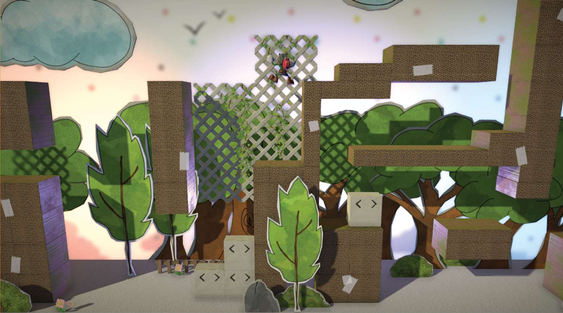

# Kid Knight

  

My team's submission to Isart Digital Montreal's Game Week 2018.

We had one week to build our game in . 
It was a lot of fun, and the end product was much appreciated by our faculty and peers:
- 🥇 **Overall**
- 🥇 **Aeshetics**

During this game jam, I was primarily involved with the gameplay programming of the `PlayerController` script and scriptable `Level Design Objects` (e.g. _ladders_, _floating platforms_, _pushable crates_, ...), but we were all helping each other out, so I got to weigh in on some other things like the camera code and post-processing shaders. It was a great first interdisciplinary experience!

**NB: This is a fork of an old mirror of an even older SVN repo. The Git history is incomplete (we essentially created a clean repo from the final project.**
